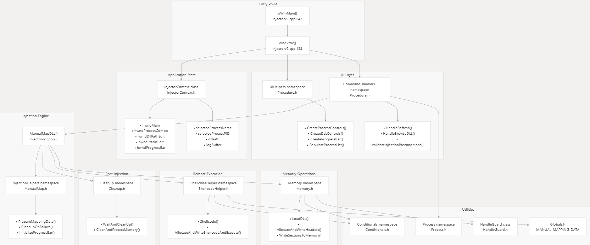

## Overview

Manual mapping DLL injector implemented in C++20 that provides a graphical user interface for selecting target processes and injecting custom DLLs. Unlike traditional injection methods that use Windows' LoadLibrary API, this injector implements the entire PE loading process manually within the target process.

Prior Commits can be found at CS2-Traf-Client repository (https://github.com/JustinAngara/CS2-TRAF-CLIENT)

## Security and anti-detection features:

**Executable name randomization:** wWinMain generates random executable name at runtime

**Header cleaning:** Removes DOS/NT headers from injected DLL

**Section removal:** Deallocates non-essential PE sections

**Memory protection adjustment:** Changes page protections to appear normal

**Direct System Implementation:** Used direct assembly instructions instead of user-mode hooks

**Shellcode cleanup:** Removes shellcode after execution

## Requirements
Visual Studio 2019+ with v145 Platform Toolset
Windows 10/11 operating system
Administrator rights (mandatory for process injection)
C++20 compiler support